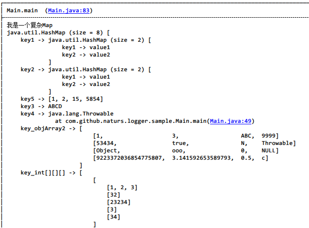

# Logger #

该库主要基于[https://github.com/orhanobut/logger][1]进行了部分修改，主要增加了以下特性：

1. 将项目更改为Java工程，可以在Java平台上输出日志；
2. 支持显示简化的日志信息；
3. 添加了对Collection、Map、多维数组、Intent、Bundle的格式化输出；
4. 支持指定调用方法栈；

部分修改参考了以下开源项目：

[https://github.com/ZhaoKaiQiang/KLog][2]

[https://github.com/JakeWharton/timber][3]

[https://github.com/pengwei1024/LogUtils][4]

## 使用方式 ##

#### 一、添加依赖 ####

	compile 'com.github.naturs.logger:logger-core:0.3'

如果用于Android平台，则额外添加以下依赖：

	compile 'com.github.naturs.logger:logger-android:0.3'

#### 二、初始化 ####

```java
// Must
// For Java
Logger.addLogAdapter(new DefaultLogAdapter("Your Global Tag"));
Logger.setLogConverter(new DefaultLogConverter());
```

```java
// Must
// For Android
Logger.addLogAdapter(new AndroidLogAdapter("Your Global Tag"));
Logger.setLogConverter(new AndroidLogConverter());
```

```java
// Optional
// Add your custom ConverterStrategy
Logger.addConverterStrategy(YourCustomConverterStrategy);
```

#### 三、使用 ####

1、一般调用方式：

```java
// 使用当前调用Logger的类的类名作为Tag
Logger.d("your log");
// 自定义tag
Logger.tag("CustomTag").d("your log");
// 打印格式化后的json
Logger.json(json);
// 打印格式化后的xml
Logger.xml(json);
// 打印Object对象，Object的转换方式通过初始化中的LogConverter和ConverterStrategy指定
Logger.obj(object);
```

2、如果想对日志进行单行输出（默认模式），则需要在初始化时进行设置，

```java
public DefaultLogAdapter(@Nullable String globalTag) {
    this.formatStrategy =
            PrettyFormatStrategy
                    .newBuilder()
                    .tag(globalTag)
                    .methodCount(1)
                    .showThreadInfo(false)
                    .optimizeSingleLine(true) // 为true则代表在可能的情况下对日志进行单行输出
                    .logStrategy(new DefaultLogStrategy())
                    .build();
}
```

如果要更改这一设置，则需要自定义`FormatStrategy`，

```java
public DefaultLogAdapter(FormatStrategy formatStrategy) {
    this.formatStrategy = formatStrategy;
}
```

3、一般情况下，直接使用`Logger`进行日志输出即可，部分情况下可能需要自定义一层封装，比如：

```java
public class LogUtils {

    public static void d(String msg) {
        Logger.obj(msg);
    }

}
```

之后使用LogUtils进行日志输出：

```java
LogUtils.d("Log with LogUtils.java");
```

这种情况下，日志输出的tag和定位的行数都会定位在`LogUtils`类中，

	Main-LogUtils: [(LogUtils.java:12)#d] Log with LogUtils.java

如果要显示调用`LogUtils`的类的tag和方法行数，可对`LogUtils`进行如下修改：

```java
public class LogUtils {
    public static void d(String msg) {
        Logger.invokeClass(LogUtils.class).obj(msg);
    }
}
```

之后的输出就会变为：

	Main-Main: [(Main.java:86)#main] Log with LogUtils.java

#### 四、效果 ####




## License ##

	Copyright 2017 naturs

	Licensed under the Apache License, Version 2.0 (the "License");
	you may not use this file except in compliance with the License.
	You may obtain a copy of the License at

	http://www.apache.org/licenses/LICENSE-2.0

	Unless required by applicable law or agreed to in writing, software
	distributed under the License is distributed on an "AS IS" BASIS,
	WITHOUT WARRANTIES OR CONDITIONS OF ANY KIND, either express or implied.
	See the License for the specific language governing permissions and
	limitations under the License.

[1]:https://github.com/orhanobut/logger
[2]:https://github.com/ZhaoKaiQiang/KLog
[3]:https://github.com/JakeWharton/timber
[4]:https://github.com/pengwei1024/LogUtils